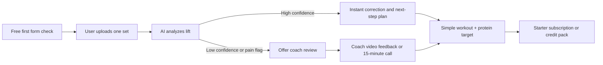
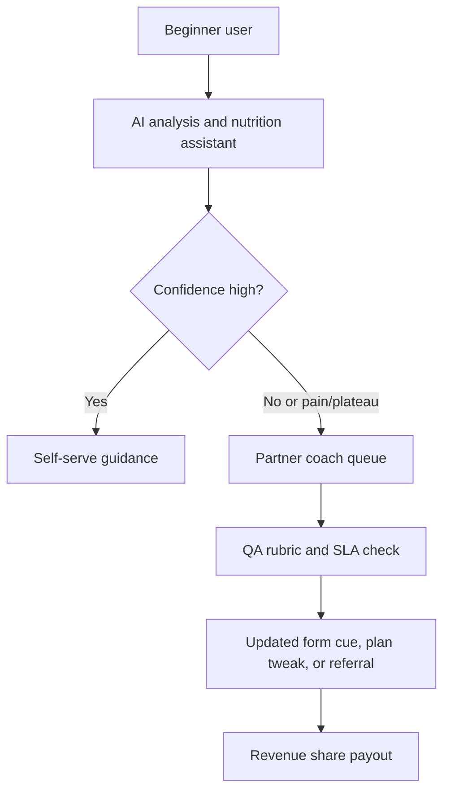

# Evidence-Led Opportunity Map for an AI Gym and Nutrition Coach

## Executive summary

The strongest opportunity is **not** to build “another workout app.” It is to build a **low-cost bridge between generic fitness apps and expensive human coaching**. Across recent Reddit threads, niche forums, Q&A sites, reviews, and GitHub issues, beginners repeatedly describe the same cluster of problems: they do not know what to do in the gym, they do not trust their exercise form, they cannot tell whether their technique is improving, and they find calorie/macronutrient guidance either confusing or too labor-intensive to follow consistently. Existing products usually solve **one** of these problems—programming, nutrition logging, or accountability—but rarely all three together in a beginner-friendly way. citeturn27view2turn27view6turn27view7turn27view11turn27view12turn27view27turn27view28

The most credible wedge for a solo, bootstrapped founder is a **beginner-focused AI coach** that does three things well: recorded-set form analysis for a narrow set of core exercises, simple protein-and-calorie guidance for real-life meals, and **micro-escalation to human coaches** only when confidence is low, pain is reported, or the user asks for reassurance. That positioning would sit materially below the price of high-touch coaching products such as Future and Trainwell, and below or around the lower edge of some hybrid offerings, while being more outcome-oriented than workout generators like Fitbod or pure nutrition apps like MyFitnessPal and MacroFactor. Future is listed at $199/month, Trainwell at $179/month as of January 2026, Caliber Premium is reported at about $200/month, while Fitbod is $15.99/month, MyFitnessPal Premium is $79.99/year, MacroFactor is $11.99/month, and RP Diet Coach is $19.99/month. citeturn29view0turn29view4turn32view0turn29view5turn29view7turn29view8turn33view3

A realistic path to **$10k/month gross revenue** is an inference, but it is plausible with a focused offer: for example, 160 users on an AI Starter plan at $24/month, 90 users on an AI-plus-coach-light plan at $49/month, plus 120 paid coach-review credits at $15 each yields about **$10,050/month gross**. That pricing stays far below the cost of most one-on-one coaching apps and well below typical in-person trainer economics, where personal training averages $40–$70 per hour nationwide and 30-minute sessions are often priced around $50–$60. citeturn34view0turn34view1turn29view0turn29view4turn32view0

The core white space is this: **cheap AI that teaches, with human escalation only when needed**. Most apps either leave the user alone with an algorithm, or they jump straight to a $179–$200+ monthly relationship. Your product can win if it becomes the trusted first-stop for beginners who want to feel safe, not stupid, and not overcharged. citeturn27view11turn27view12turn27view13turn27view14turn27view15turn30view2

## Method and how to read this report

This report is based on a **targeted review of roughly 60 recent English-language items** from January 2023 through May 2026, prioritizing community evidence and official product pages. The evidence base includes Reddit threads, niche communities such as MyFitnessPal Community and app-specific forums, Fitness Stack Exchange questions, Trustpilot reviews, GitHub issues, and official competitor pricing and feature pages. Where official pricing was not public, I used clearly labeled secondary review sources.

The “frequency” labels below are **directional counts from this reviewed sample**, not population estimates. I used the following interpretation:

| Signal label | Meaning in this report |
|---|---|
| **5+ mentions** | Recurred frequently across the reviewed source set and usually across multiple source types |
| **3–4 mentions** | Recurred clearly, but with less breadth |
| **2 mentions** | Present and credible, but less broadly evidenced in the sample |
| **Confidence** | My synthesis of recency, source diversity, and clarity of user pain |

That means these findings are best read as **evidence-led prioritization**, not market sizing.

## Pain points and opportunity map

### Training and form pain points

| Pain point | Direct evidence | Signal | Product response |
|---|---|---|---|
| **Gym intimidation and social discomfort** | MyFitnessPal Community, **Feb. 7, 2024**: a new member said joining a gym was “**more out of my comfort zone**” and asked how to deal with gym anxiety. Reddit r/xxfitness, **2024**: one user remembered being “**too intimidated to even walk into the weight room**.” citeturn4search2turn27view1 | **3+ mentions**; latest clear signal **2024**; **Medium** confidence | **AI:** first-week gym onboarding, “what to do in your first 30 minutes,” and low-visibility audio cues. **Coach:** 10-minute “first gym visit” walkthrough or pre-recorded reassurance review. **Monetization:** free onboarding; $9–$19 one-off confidence session; included in $19–$29 starter tier. |
| **Not knowing where to start** | Reddit r/Fitness, **late 2024**: “**I have no idea what I’m doing** … I don’t know what I should be doing each week or how much.” Another Reddit beginner asked on **Dec. 21, 2024** what routine to do with limited equipment and said the wiki routines did not fit a setup that felt safe. citeturn27view2turn27view3 | **4+ mentions**; latest **Jan. 2025**-era beginner-program shopping is similar. citeturn22search12 | **AI:** goal-and-equipment intake that outputs a *very small* novice plan library, not infinite options. **Coach:** first-plan sanity check. **Monetization:** starter subscription; upsell to coach-approved plan review. |
| **Vague or conflicting advice** | Reddit r/xxfitness, **2025**: “**lift heavy**” felt so vague that the user had “**no idea what it even means**.” Another thread argued the industry keeps selling “**toning**” as a separate concept, especially to women. citeturn27view4turn27view5 | **3+ mentions**; latest **2025**; **Medium** confidence | **AI:** translate jargon into concrete loads, rep targets, RPE ranges, and progression rules. **Coach:** optional “decode my goal” consult. **Monetization:** free educational glossary; paid personalized target-setting. |
| **Form uncertainty and fear of injury** | Fitness Stack Exchange, **Dec. 2023**: “**How do I know I am squatting properly?**” after knee pain. A beginnerfitness poster said their “**biggest issue is knowing correct form**” and that they “**can never tell**” if they’re doing things right even with a mirror or privacy at home. citeturn27view6turn22search0 | **5+ mentions**; latest **2026** form-check demand remains active. citeturn27view7turn20search9 **High** confidence | **AI:** narrow, high-quality form analysis for 6–8 lifts; frame-by-frame “what to fix first.” **Coach:** paid second opinion when AI confidence is low or pain is mentioned. **Monetization:** free first form check; $15 coached review; $39–$59/mo bundle with credits. |
| **Cannot tell whether technique is improving** | Fitness Stack Exchange, **Apr. 8, 2026**: “**I watch videos of myself but I genuinely can’t tell** … whether I’m actually improving.” Form-check communities also show repeated requests such as “**Can you give me feedback on my squat form**” from self-described newbies. citeturn27view7turn20search9 | **3–4 mentions**; latest **Apr. 2026**; **High** confidence | **AI:** change-over-time scoring, side-by-side overlays, and “one correction per week” tracking. **Coach:** monthly technique audit. **Monetization:** premium analytics in paid tier; quarterly coach audit upsell. |
| **Progression confusion** | Reddit r/Fitness, **Jul. 1, 2025**: “**I’m not sure what to do when it comes to adding weight or adding reps**.” The “lift heavy” thread shows similar uncertainty around what “heavy” should mean by movement. citeturn27view8turn27view4 | **3+ mentions**; latest **Jul. 2025**; **Medium** confidence | **AI:** explicit progression engine that says exactly when to add reps, weight, or ease off. **Coach:** plateau triage or progression override. **Monetization:** progression engine in core paid tier; plateau consult as add-on. |
| **Equipment unavailability and substitution friction** | r/fitbod feature request, **2025**: equipment being occupied changes what reps and weights make sense. Another beginner on **Dec. 21, 2024** said common routines did not fit a setup that felt safe without a rack. Another fitbod wish-list user wanted gym-specific equipment profiles because app recommendations were inaccurate when machines and plates differed. citeturn27view9turn27view10turn21search6 | **4+ mentions**; latest **2025**; **High** confidence | **AI:** instant substitutions that preserve training effect and account for order changes. **Coach:** “build my gym profile” setup. **Monetization:** gym-profile feature in paid tier; coach onboarding package for home-gym users. |
| **Need safe modifications for injury, pain, mobility, or deconditioning** | r/xxfitness, **2025**: a user returning from a herniated disc with sciatica said they could initially walk “**<5 mins a day without major pain**” and felt exhausted enough to struggle with physio exercises. Another r/xxfitness thread cataloged everyday exercise limitations: “**it just does not feel safe**,” “heavy squats: **bad for my back**,” wrists, knees, numbness, dizziness. A trainer-seeking user said they wanted help because they had experienced “**pain / injury before**” when training alone. citeturn28view0turn28view1turn28view2turn28view3 | **4+ mentions**; latest **2025**; **High** confidence | **AI:** restrictions-aware exercise library and “do not coach around pain” safeguards. **Coach:** coach or clinician referral path; modification micro-session. **Monetization:** restrictions support in paid tier; premium escalation to vetted coach or RDN/CSSD partner. |

### Nutrition, support, and tooling pain points

| Pain point | Direct evidence | Signal | Product response |
|---|---|---|---|
| **Current apps still feel generic, non-intuitive, or under-instructional** | Future Trustpilot review: “**The app does not come with any type of manual**” and “**is not super intuitive**”; if the coach misses something, “**there is nothing you can do about it**.” A long-term Fitbod user said it became “**mostly useful as a tracker**” and they had to learn elsewhere. A Freeletics user regretted subscribing after two weeks, citing “**poor instructions**” for exercises. citeturn27view11turn27view12turn27view13 | **5+ mentions**; latest **2026**-adjacent review ecosystem; **High** confidence | **AI:** beginner-first UI, explicit demos, and “why this exercise” explanations. **Coach:** only for escalation, not as a patch for a confusing product. **Monetization:** better UX is table stakes; differentiates paid conversion more than direct upsell. |
| **Human coaching is valuable but often too expensive** | r/xxfitness, **2024**: “**$400 per month is a lot!**” A SingaporeFitness poster said trainers charging “**$100+ a session** … adds up fast.” Official cost context is similar: personal training averages **$40–$70/hour** in the U.S., while group sessions average **$15–$45** and online training can run **$50–$150/month**. citeturn27view14turn27view15turn34view0 | **5+ mentions**; latest **Sep. 2025** official cost update; **High** confidence | **AI:** replace most low-complexity check-ins. **Coach:** sell micro-help, not long retainers first. **Monetization:** undercut high-touch products with $19–$29 AI core, $39–$59 AI+coach-light, and $15–$40 micro-sessions. |
| **People want quick expert help, not slow or generic coaching** | A workout subreddit user said they had “**paid for countless coaches**” who did not “**give … the time of day**” or insightful responses. Future’s review page also showed frustration that if the coach misses mistakes, the user cannot self-correct in the app. Trainerize argues that a **$300/month** high-touch offer should include customization, nutrition support, check-ins, and responsiveness. citeturn22search4turn27view11turn34view1 | **3–4 mentions**; latest **2026** pricing guidance; **Medium** confidence | **AI:** instant answer layer for common questions. **Coach:** SLA-backed queue for low-confidence videos and quick calls. **Monetization:** sell response-time guarantees; 24-hour review credits; premium response SLA tier. |
| **Consistency and accountability are harder than getting a plan** | MyFitnessPal Community in **2025** had repeated “stay motivated and consistent” threads and challenge threads framed around “**staying consistent**.” An r/xxfitness response said to “**never rely on motivation**” and instead make exercise a habit. r/Fitness replies to beginners stressed that consistency matters more than having the perfect program. citeturn23search7turn23search10turn27view17turn23search2 | **5+ mentions**; latest **2026** challenge threads continue the same theme. citeturn23search13 **High** confidence | **AI:** streak-preserving scheduling, skipped-workout recovery plans, and adaptive goals. **Coach:** accountability nudges and weekly reset check-ins. **Monetization:** habit features in all paid plans; extra accountability as upsell. |
| **It is hard to tell if progress is real** | An xxfitness user after **5 months** said “**I’m not seeing the progress I expected**.” A CICO post described menstrual-cycle weight gain that made it impossible to “**accurately assess my progress**.” Another CICO reply emphasized daily weighing because fluctuations otherwise hide “**real progress**.” citeturn27view19turn27view20turn27view21 | **5+ mentions**; latest **Apr. 2026**; **High** confidence | **AI:** trend dashboards that separate scale noise from adherence, strength, and form improvement. **Coach:** “am I actually progressing?” consult. **Monetization:** advanced progress analytics in paid tier; monthly coach interpretation add-on. |
| **Calories and macros are confusing** | MyFitnessPal Community, **Mar. 6, 2025**: “**Are these good calorie and macro goals … I’m a beginner and I need all the help**.” Another MFP thread in **Jan. 2025** asked whether a protein goal was “**way too high**.” Fitness Stack Exchange, **Jun. 10, 2023** asked whether a **50/30/20** macro split was appropriate for losing fat while retaining muscle. citeturn4search0turn4search8turn27view24 | **5+ mentions**; latest **2025**; **High** confidence | **AI:** plain-English calorie/protein targets with confidence ranges and explanations. **Coach/RDN:** escalate for unusual goals or medical conditions. **Monetization:** nutrition target engine in paid core; disease-specific escalation only via partner RDN. |
| **Protein goals, portioning, and eating out are hard in real life** | Fitness Stack Exchange highlighted a user trying to reach **180–200g protein/day** from food alone. A MacroFactor user traveling asked where to find “**quality whole foods**,” maintain “**a high protein diet while on the road**,” and “**track portion sizes when eating out**.” citeturn27view25turn27view26 | **3+ mentions**; latest **2025**; **High** confidence | **AI:** protein gap alerts, restaurant estimation mode, meal templates by goal and budget. **Coach:** meal-structure review, travel-week rescue plan. **Monetization:** nutrition assistant in core plan; travel-week pack or meal-template bundle as upsell. |
| **Logging food is tedious and inaccurate** | r/CICO, **2024**: “**Tracking Calories is Annoying**” and failure felt overwhelming. A GitHub issue framed the same problem bluntly: calorie apps require “**extensive manual entry or barcode scanning**,” a daily friction many users abandon quickly. Another nutrition-app GitHub issue asked for backup barcode providers because if a barcode is not found, users hit interruption and friction. citeturn27view27turn27view28turn27view29 | **5+ mentions**; latest **Mar. 2026**; **High** confidence | **AI:** text/photo/voice logging, rough-estimate mode, cached foods, and “good enough” logging instead of perfectionism. **Coach:** none by default; reserve humans for unusual meals or adherence coaching. **Monetization:** time-saving logging is a conversion driver; gate smart logging and restaurant estimation behind paid plans. |

### What these pain points imply for product strategy

The report’s most important synthesis is that beginners are not merely asking for **information**. They are asking for **confidence**. They want to know: *What do I do today? Am I doing it right? Am I safe? Is this working? What should I eat?* The recurring demand is for **interpretation and reassurance**, not just workout generation or food databases. citeturn27view2turn27view6turn27view7turn27view19turn27view27

That is why a beginner AI coach should not chase broad “AI fitness” positioning at launch. It should sell a much narrower promise: **“I’ll help you train with confidence, correct your core lifts, and keep your nutrition simple—and if the AI is uncertain, a real coach can step in fast.”** That positioning is directly aligned with the gaps visible in community complaints about Fitbod, Freeletics, and even high-touch coaching apps. citeturn27view11turn27view12turn27view13

## Competitor landscape and the clearest white space

| Product | Current pricing | Core offer | Best for | Strengths | Gaps relevant to your opportunity |
|---|---|---|---|---|---|
| **Future** | **$50 first month, then $199/month**. citeturn29view0 | Dedicated 1:1 remote coach with programming and messaging. citeturn29view0 | Users who already accept premium coaching spend | Strong accountability and human attention | Too expensive for many beginners; review complaints cite poor self-serve UX and dependence on coach quality. citeturn27view11 |
| **Trainwell** | **$179/month** as of Jan. 2026; **14-day free trial** with a free **40-minute call** and near-daily communication. citeturn29view3turn29view4 | Human-first remote training and health planning | Users who want accountability and a trainer relationship | Strong trial/onboarding and habit support | Still priced as a coaching relationship, not a lightweight beginner tool; no differentiated beginner form-teaching wedge visible from public pages. citeturn29view3turn29view4 |
| **Caliber** | Public site emphasizes consultation; a major reviewer lists **Free**, **$19/month Pro group coaching**, and **$200+/month Premium**. citeturn29view1turn30view2turn32view0 | Strength app with free logging, plus personalized plans and premium coaching | Users who want a mix of app + coaching | Strong exercise tutorials, nutrition targets, video form reviews, and clear tiering. citeturn30view2 | Premium still lands near $200/month; strong but not “quick, low-cost escalation” oriented for first-timers. |
| **Fitbod** | **$15.99/month** or **$95.99/year**. citeturn29view5 | Personalized strength workout generator | Cost-conscious lifters who want workout automation | Affordable, broad equipment support, simple value prop. citeturn29view6 | Community feedback says it becomes “mostly useful as a tracker”; weak trust on teaching and exercise rationale for beginners. citeturn27view12 |
| **Zing Coach** | Public web pricing is **not transparent**; official pages say premium plans are available monthly, quarterly, or yearly and include in-app purchases. citeturn29view15turn30view0 | AI coach with body scan, daily check-ins, and camera-based form monitoring | Users excited by AI-first coaching | More advanced AI coaching language than most apps; real-time form monitoring and camera use are public differentiators. citeturn30view0 | Opaque pricing on public web; no human coach layer visible; trust still depends on camera accuracy. |
| **Tempo** | **$39/month** AI Personal Training; bundle with hardware from about **$50/month** total. citeturn31view1 | AI personal training plus optional home-gym hardware | Home users willing to buy into a system | Real-time feedback, training guidance, and hardware-enhanced experience. citeturn31view0turn29view16 | Hardware/home context constrains audience; less suited to everyday commercial-gym beginners. |
| **Tonal** | **$59.95/month** membership, plus hardware purchase and 12-month commitment. citeturn29view13 | Connected home gym with guidance, classes, coaching cues, progress tracking | Higher-income home strength users | Strong on strength UX, safety language, progress tracking, and coaching cues. citeturn31view2turn31view3 | Hardware and commitment make it a different market; not a cheap mobile bridge product. |
| **MyFitnessPal** | Premium **$79.99/year**; Premium+ **$99.99/year**. citeturn29view7 | Large-scale nutrition tracking and meal planning | Users who mainly want calorie tracking | Huge brand, logging database, meal-planning extensions | Does not solve gym form or premium interpretation of progress; community still shows confusion around calories/macros and consistency. citeturn4search0turn4search8turn23search7 |
| **MacroFactor** | **$11.99/month**, **$47.99/6 months**, **$71.99/year**. citeturn29view8 | Science-based diet coaching with weekly check-ins and target adjustment | Users who care about nutrition precision | Excellent adaptive nutrition model and privacy-forward positioning. citeturn29view8turn29view9 | No movement teaching or beginner gym confidence layer; still presumes willingness to log carefully. |
| **RP Diet Coach** | **$19.99/month** or **$99.99/year**. citeturn33view0turn33view3 | Personalized diet coach with weekly macro review and reminders | Physique-oriented nutrition users | Strong planning/accountability language; explicit anti-guesswork positioning. citeturn29view10turn29view11 | Nutrition-specialized, not form-specialized; better for committed users than the fully overwhelmed beginner. |

### The clearest market gap

The competitor grid shows a sharp split:

- **Cheap workout apps** are affordable, but beginners still go elsewhere for instruction and reassurance. citeturn29view5turn29view6turn27view12
- **Nutrition apps** solve tracking better than workout apps, but they do little for form, gym anxiety, or exercise progress interpretation. citeturn29view7turn29view8turn29view10
- **Human-coaching apps** solve accountability, but their pricing usually assumes the user is ready for an ongoing relationship at roughly **$179–$200+/month**. citeturn29view0turn29view4turn32view0
- **Form-feedback products** tend to be AI-only or hardware-centric. citeturn30view0turn31view1turn31view2

That leaves a strong white space for a product that combines:

1. **Beginner-safe form teaching**
2. **Basic but useful nutrition guidance**
3. **Cheap human micro-escalations instead of full-time coaching**

In other words: **less planning than Caliber/Future/Trainwell, more teaching than Fitbod, and more gym-specific confidence than MyFitnessPal/MacroFactor/RP.** That is the most believable bootstrapped wedge.

## Recommended MVP and prioritized growth experiments

### MVP scope

The MVP should be intentionally narrow:

| MVP component | Include now | Exclude for now |
|---|---|---|
| **Audience** | English-speaking beginners in their first 6–12 months of lifting; goals: build confidence, gain muscle, lose fat, “look toned,” or general gym literacy | Rehab-heavy users, minors, pregnancy-specific coaching, disease-focused users |
| **Exercise coverage** | 6–8 high-frequency movements: squat, hinge/RDL, bench or push-up, row, overhead press, lat pulldown, lunge, plank | Olympic lifts, CrossFit movements, advanced sports performance |
| **Form product** | **Recorded-set analysis first**, not fully live correction; camera setup guide; confidence score; low-confidence escalation | Always-on live coaching across all exercises |
| **Nutrition product** | Personalized calorie and protein target, meal templates, restaurant estimation mode, photo/text logging, protein-gap reminders | Full meal planner, supplement protocols, disease-specific nutrition therapy |
| **Human layer** | Coach-reviewed form check, 15-minute live “fix my form” call, plateau consults, and referrals to RDN/CSSD or clinician partners when needed | Matching every user to a dedicated monthly coach |
| **Safety** | Intake questions, pain/red-flag detection, “stop and escalate” rules, privacy-first video handling | Broad claims of injury prevention or medical-grade diagnosis |

This scope directly matches the evidence: beginners disproportionately need help with first plans, core lift confidence, progression, food fundamentals, and consistency—not advanced optimization. citeturn27view2turn27view6turn27view7turn27view8turn27view27

### Suggested product flow

### Suggested coach-partnership model

### Pricing ladder that fits the evidence

A sensible launch ladder, as an inference from current market pricing, would be:

- **Free**: onboarding, one exercise profile, limited form checks, calorie/protein target
- **AI Starter**: **$19–$29/month**
- **AI + Coach Light**: **$39–$59/month**, with 1–2 coach credits
- **Coach-reviewed form check**: **$9–$19**
- **15-minute live coach fix**: **$25–$40**
- **Later premium tier**: **$99–$149/month** for higher-touch check-ins

That keeps you above generic tracker pricing but well below Future, Trainwell, Caliber Premium, and normal PT economics. citeturn29view0turn29view4turn32view0turn34view0turn34view1

### Prioritized growth and monetization experiments

| Experiment | Why it is high priority | Effort | Revenue impact hypothesis |
|---|---|---|---|
| **Coach-reviewed form-check upsell** | This is the cleanest bridge from AI to paid value. Users are already asking “am I doing this right?” and existing apps leave trust gaps. Offer free AI output, then upsell a coached review when the model is low-confidence or the user wants certainty. citeturn27view6turn27view7turn27view11turn27view12 | **Medium** | If you drive 100 paid coached reviews/month at $15 average, that is **$1.5k gross/month** before subscription effects. |
| **Beginner Starter subscription** | Package the highest-frequency needs into one monthly plan: 3 gym days/week, 6 supported lifts, protein target, and 6–10 smart form checks/month. This directly addresses the “I have no idea what I’m doing” problem. citeturn27view2turn27view3turn27view8turn4search0 | **Medium** | 150 users at $24/month yields **$3.6k gross MRR**. This is the more scalable base layer. |
| **Coach affiliate and office-hours partnerships** | Recruit independent trainers who are good on camera and pay them for micro-reviews or mini office hours. This can become both supply and acquisition if coaches promote “first form check free.” Community evidence suggests users want help but reject full PT pricing. citeturn27view14turn27view15turn22search4 | **Low to medium** | 15 coaches each driving 5 paying subscribers or 10 credits/month can add **$2k–$4k gross/month** while expanding supply without a payroll-heavy team. |

### What I would build first

If I were optimizing for your exact constraints—solo founder, minimal team, no VC—I would ship this sequence:

**Phase one**
A mobile-friendly web app that supports one camera angle, one profile, one short onboarding, and **recorded analysis for squat, push-up/bench, RDL, row, overhead press, and lat pulldown**. Add a calorie/protein target and simple text/photo food logging.

**Phase two**
Add **coach review credits** and a lightweight coach console. Prioritize low-confidence flags, pain reports, and beginner questions like “what should I swap this for?” or “how much weight should I use?”

**Phase three**
Add progress interpretation, gym-specific equipment profiles, and more automated nutrition estimation.

That sequencing minimizes the hardest problem—real-time multi-exercise CV accuracy—while monetizing the trust gap immediately.

## Risks, KPIs, and limitations

### Legal, ethical, and accuracy risks

| Risk | Why it matters | Mitigation |
|---|---|---|
| **Injury or medical-risk coaching** | Users with chest symptoms, dizziness, syncope, severe pain, or chronic conditions can be harmed if the app treats all feedback as normal gym coaching. ACSM guidance stresses screening and escalation when signs or symptoms appear; heart-health guidance similarly treats chest pain, shortness of breath, and dizziness as serious. citeturn35search19turn36search4turn36search8 | Restrict MVP to low-risk wellness use cases; ask intake questions; hard-stop on chest pain, severe pain, fainting, severe breathlessness, or new neurologic symptoms; escalate to clinician. Do not market the app as rehab or medical care. |
| **Nutrition scope creep into medical nutrition therapy** | CMS defines medical nutrition therapy around disease management and ties it to registered dietitians or qualified nutrition professionals; the Academy describes MNT as individualized intervention for medical conditions and diseases. citeturn37search4turn37search5turn37search21 | In MVP, stay in general wellness: calories, protein, meal structure, adherence. Route diabetes, renal disease, eating disorders, severe underweight, and other medical conditions to partner RDNs. |
| **Deceptive claims and overstated results** | The FTC’s Health Products Compliance Guidance says health-related claims must be truthful, not misleading, and backed by science; the same principles apply to health-related apps. citeturn35search1turn35search5turn35search9 | Avoid claims like “perfect form correction,” “injury prevention,” or guaranteed body transformations unless validated. Publish narrow supported-exercise claims and real confidence limits. |
| **Health-data privacy and breach exposure** | HHS notes HIPAA often does **not** apply to standalone health apps that are not offered by covered entities, while the FTC’s updated Health Breach Notification Rule explicitly reaches health apps and similar technologies. citeturn35search2turn35search4turn35search6turn35search12 | Default-delete videos after analysis unless users opt in; encrypt in transit and at rest; minimize trackers/SDKs; build a breach-notification playbook; have a plain-language privacy policy and consent screen. |
| **AI accuracy and overconfidence** | Camera-based systems can analyze human pose, but community evidence shows users and builders still run into barcode misses, missing instructions, generic workout logic, and trust breakdown when the app cannot adequately self-correct or explain itself. MediaPipe Pose itself is a landmark-tracking system, not a complete exercise coach. citeturn6search17turn27view11turn27view12turn27view29 | Keep supported motions narrow; show confidence scores; ask for camera setup; say “not enough signal” instead of bluffing; use coach escalation; QA outputs across body sizes, clothing, lighting, and equipment environments. |
| **Coach quality and partner inconsistency** | Community evidence shows mixed experiences with trainers, including poor fit, generic programming, and even injury from mismatched coaching style. citeturn28view4turn27view14 | Vet coaches, define rubrics, review recordings, enforce SLAs, gather coach-level CSAT and refund rates, and require liability coverage or equivalent protections for partners. |

### Metrics and KPIs to track

The best KPI stack should reflect your actual wedge: **confidence, adherence, and escalation efficiency**.

| KPI category | Metrics to track |
|---|---|
| **Acquisition** | Landing-page conversion rate, cost per signup, percent of users who upload a first video, percent who connect a goal and equipment profile |
| **Activation** | Time to first successful form analysis, percent receiving a usable correction within the first session, percent completing first workout and first nutrition target day |
| **Core product quality** | AI confidence distribution, coach-override rate, low-confidence rate by exercise, false-positive pain flags, user-rated helpfulness of each correction |
| **Retention** | Day-7 and Day-30 retention, workouts per active user per week, food-logging days per week, percent returning for second form check, streak survival after missed sessions |
| **Monetization** | Free-to-paid conversion, percent buying coach credits, average revenue per paying user, credits purchased per subscriber, refund rate, contribution margin per coach-reviewed session |
| **Outcome proxies** | Form score improvement on repeat lifts, progression adherence, protein-target hit rate, self-reported gym confidence, self-reported “I know what to do today” score |
| **Safety** | Pain-report rate, red-flag escalation rate, time-to-human review for flagged videos, number of sessions blocked for safety, user-reported adverse-event rate |

A very good **north-star metric** for this business would be: **weekly successful coached workouts**, defined as workouts where the user completed the session, received either AI or human guidance on at least one key issue, and returned within seven days. That metric connects acquisition, product value, retention, and monetization.

### Open questions and limitations

This report is strong on **qualitative demand signals** and current competitor economics, but it has three limitations.

First, some app-store review systems and closed communities are only partially visible to web indexing, so the evidence base leans toward web-accessible discussions, reviews, and help pages.

Second, competitor pricing is not equally transparent. For products such as Caliber Premium and Zing, the most specific public numbers are either secondary reviews or app-store purchase frameworks rather than a clean public pricing page. I have labeled those cases accordingly. citeturn32view0turn29view15

Third, the frequency numbers in the pain-point tables are **directional counts from a targeted research sample**, not representative market prevalence estimates. They are still useful for **prioritization**, which is the decision you need right now as a bootstrapped founder.

The bottom line is still clear: the market keeps forcing beginners to choose between **cheap but lonely** and **helpful but expensive**. A trustworthy, narrow, beginner-first AI coach with low-cost human escalation is one of the clearest product gaps visible in the current evidence.